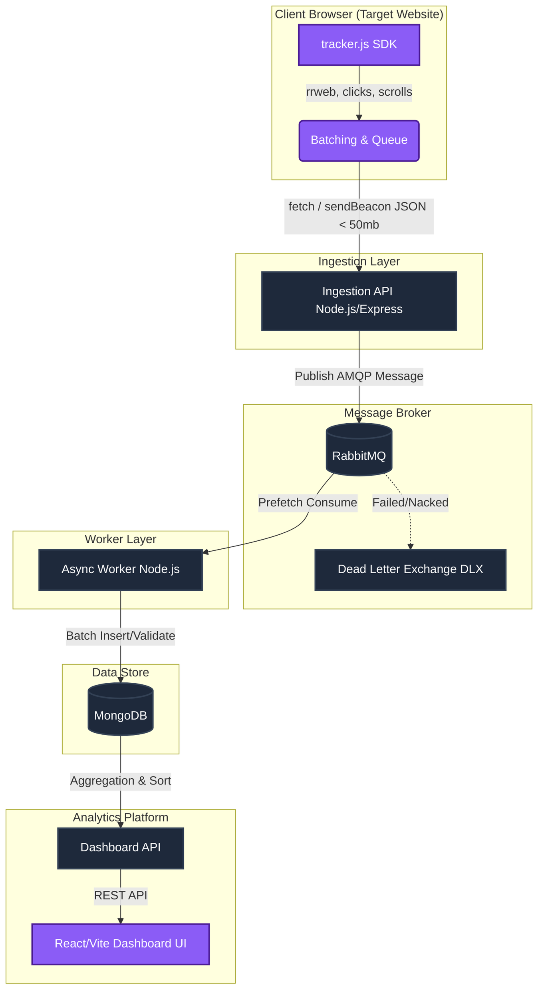

# Project Architecture: Web Analytics Tracking Platform

This document outlines the current decoupled, microservices-style architecture built primarily on Node.js, React, and MongoDB. It seamlessly captures user behavior entirely in the background without impacting the target website's performance.

## 1. System Components

Our stack is split into 5 core domains:

**1. Client Tracker (`tracker.js`)**
- An SDK injected into client websites.
- Features custom batching and queuing logic using `navigator.sendBeacon` (on page unload) and standard `fetch` APIs.
- Captures `pageview`, `click`, `scroll`, and uses the `rrweb` CDN to capture full DOM mutations (`session_record`) for video playback.

**2. Ingestion API (`api/server.js`)**
- A fast, horizontally-scalable Node.js/Express server (running on Port 3000).
- Sole responsibility: Receive heavily batched JSON payloads (up to 50mb chunks to tolerate rrweb blobs) from the client tracker via CORS, lightly sanitize them, and immediately push them onto a RabbitMQ message bus to ensure the HTTP request completes instantaneously. 

**3. Async Worker (`worker/consumer.js`)**
- A background Node.js daemon consuming messages via AMQP from the RabbitMQ `events_queue`.
- Sole responsibility: Rate-limit and reliably persist the high-volume streaming data into a MongoDB database (`analytics` -> `events` collection). Validates payloads against our JSON Schema rules.

**4. Dashboard Serving API (`api/dashboard-server.js`)**
- A separate Node.js/Express REST API (running on Port 4000) that powers the internal reporting dashboard.
- Features heavy read-queries, such as MongoDB `$aggregate` pipelines that accurately `$sort` internal `metadata.rrwebEvent.timestamp` arrays before passing them off as clean playback traces.

**5. Frontend Web Apps**
- **E-commerce Demo**: A React/Vite dummy testing site serving the Tracker snippet.
- **Analytics Dashboard**: A React/Vite application visualizing metrics, rendering absolute-positioned heatmap coordinates dynamically over an iframe of the target site, and rendering playable session videos via `rrweb-player`.

---

## 2. Architecture Diagram

---

## 3. Recommended Scalability Enhancements

**A. The MongoDB Write Bottleneck**
*   **The Problem:** `worker/consumer.js` is doing individual `.insertOne()` calls or frequent writes to a single MongoDB collection. High-volume analytics systems suffer from IOPS exhaustion and lock contention if writes aren't optimized.
*   **The Solution:** 
    1.  **Micro-batching:** Update the worker to acknowledge (ACK) messages from RabbitMQ in batches. Instead of inserting 1 event at a time, accumulate 500 events (or wait 2 seconds) and use MongoDB's `insertMany()`.
    2.  **Time Series Collections:** Modern MongoDB offers native Time Series collections. By creating `events` as a Time Series collection organized by your `timestamp` field, MongoDB drastically compresses the data footprint and optimizes it for the chronological `$sort` queries your Dashboard uses.

**B. The RabbitMQ Payload Size Bottleneck**
*   **The Problem:** Pushing `50mb` JSON blobs deeply containing `rrweb` DOM structures into RabbitMQ can cause massive memory spikes, halting the message broker entirely. RabbitMQ prefers millions of tiny messages, not large ones.
*   **The Solution:** Implement **"Claim Check Pattern"**. The Ingestion API should immediately upload the heavy `rrweb` blobs directly to a cheap Object Storage bucket (like AWS S3). It then pushes a *tiny* message to RabbitMQ containing just `{ "s3_uri": "bucket/event-123.json" }`. The worker reads the URI and pipes it into MongoDB (or Snowflake/Clickhouse).

**C. The Ingestion API CPU Bottleneck**
*   **The Problem:** Node.js runs on a single thread. Parsing a 50mb JSON blob via `express.json()` blocks the Event Loop, causing concurrent incoming tracker requests to timeout.
*   **The Solution:** Offload JSON parsing to a load balancer or rewrite the extremely lightweight Ingestion API in a high-concurrency language like Go or Rust. Alternatively, bypass Express parsing entirely by using native Node Streams to pipe the raw HTTP request body directly into Object Store/RabbitMQ without `JSON.parse`.

---

## 4. System Resiliency Strategy

**Client-Side Resilience (Tracker Retries)**
*   **Local Storage Buffer:** If a user closes the page before `sendBeacon` fires, or if their internet disconnects, data is lost. The tracker should persist the batch queue to `window.localStorage` or `IndexedDB`. When the SDK initializes on the *next* page load, it checks storage and flushes any stale payloads.
*   **Exponential Backoff:** If `fetch` to the Ingestion API yields a `503 Service Unavailable`, the tracker should not immediately retry. Implement exponential backoff (retry in 1s, 2s, 4s...) to prevent your own clients from unintentionally DDoS-ing your recovered server.

**Backend Resilience (RabbitMQ DLX)**
When MongoDB rejects an event (e.g., failed JSON Schema validation, or database downtime), the worker currently drops or infinitely loops it. 
*   **Implement a Dead Letter Exchange (DLX):** 
    1.  Configure the `events_queue` with an `x-dead-letter-exchange` argument pointing to a `failed_events_exchange`.
    2.  If the worker catches a severe error (like a schema validation failure), it calls `channel.reject(msg, false)` (NACK without requeue).
    3.  RabbitMQ automatically forwards the rejected message to the DLX.
    4.  You can then build a secondary monitoring worker that pulls from the DLX, logs the exact `rrweb` payload, and saves it to a simple file system (for manual human inspection) so no telemetry data is ever lost.
